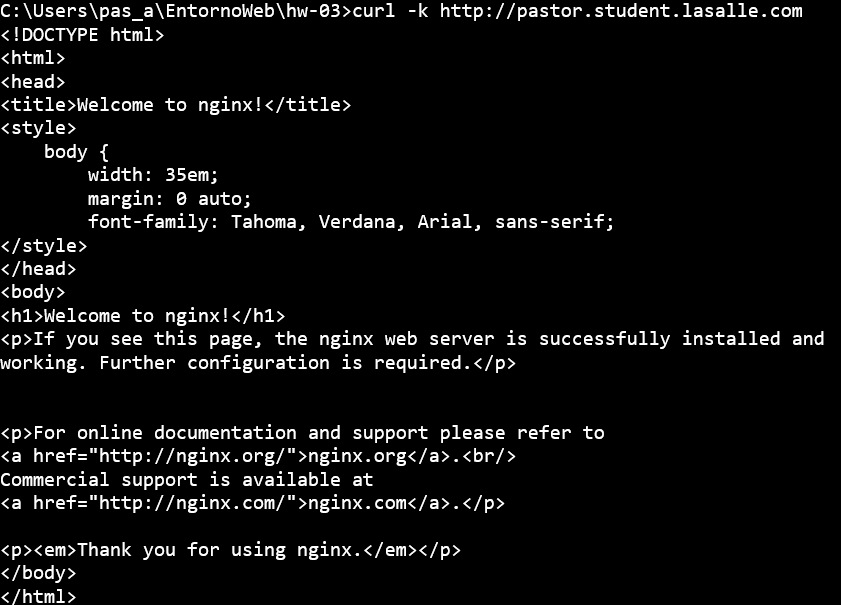
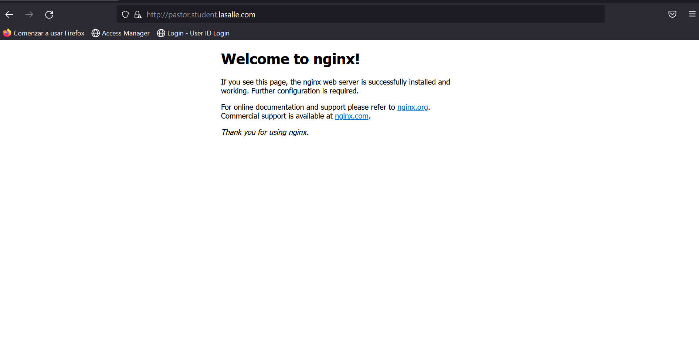

# 1.- Ejercicio

## a

Replicaset
``` yaml
apiVersion: apps/v1
kind: ReplicaSet
metadata:
  name: nginx-replicaset
spec:
  replicas: 3
  selector:
    matchLabels:
      app: nginx-server
  template:
    metadata:
      labels:
        app: nginx-server
    spec:
      containers:
        - name: nginx
          image: nginx:1.19.4
          ports:
            - containerPort: 80
          resources:
            requests:
              cpu: "20m"
              memory: "128Mi"
            limits:
              cpu: "20m"
              memory: "128Mi"
```

Servicio

``` yaml
apiVersion: v1
kind: Service
metadata:
  name: nginx-service
spec:
  selector:
    app: nginx-server
  ports:
    - protocol: TCP
      port: 80
```

Los creamos y utilizando el comando de apoyo vemos lo siguiente

``` curl -k http://pastor.student.lasalle.com ```




## b

Creamos la el certificado

``` openssl req -x509 -nodes -days 365 -newkey rsa:2048 -keyout tls.key -out tls.crt ```


Creamos el Secret

``` kubectl apply -f secret.yaml  ```


Agregamos el secret al Ingress

``` yaml
apiVersion: networking.k8s.io/v1
kind: Ingress
metadata:
  name: nginx-ingress
  annotations:
    kubernates.io/ingress.class: nginx
    nginx.ingress.kubernetes.io/ssl-redirect: "true"
spec:
  tls:
    - hosts:
        - pastor.student.lasalle.com
      secretName: nginx-secret
  rules:
    - host: pastor.student.lasalle.com
      http:
        paths:
          - path: /
            pathType: Prefix
            backend:
              serviceName: nginx-server-service
              servicePort: 80
```


