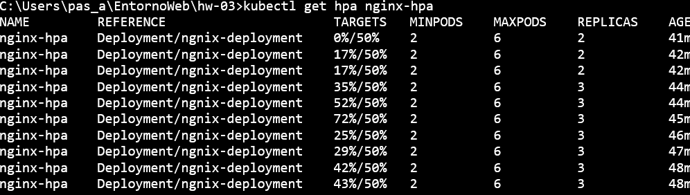

# 3.- Ejercicio

## Creamos deployment service

``` kubectl apply -f deployment_3.yaml ```
``` kubectl apply -f service.yaml ```


## Creamos HPA

``` kubectl autoscale deployment nginx --cpu-percent=50 --min=2 --max=6 ```

## Realizamos una prueba de estrés con la siguiente introducción:

```kubectl run -i --tty load-generator --rm --image=busybox --restart=Never -/bin/sh -c "while sleep 0.01; do wget -q -O- http://nginx-service; done"```

## Para poder ver la carga usamos el siguiente comando

```kubectl get hpa nginx-hpa```



